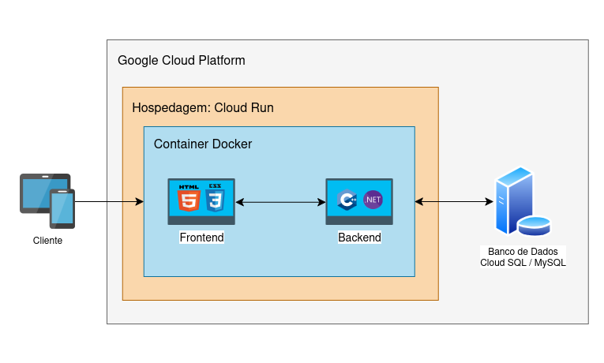

## Google Cloud Platform (GCP)

A escolha do Google Cloud Platform ocorreu porque a plataforma permite hospedar o projeto inteiro dentro do plano gratuito durante a fase acadêmica, zerando o custo financeiro. O GCP oferece suporte direto para a nossa stack de C# e MySQL, o que evita a necessidade de reescrever código ou trocar de banco de dados só para o deploy funcionar. O fato de o integrante Pedro Lucas já ter experiência prévia com o painel e os serviços do Google também pesou na decisão, pois reduz o tempo gasto com configuração inicial e evita erros comuns de infraestrutura.

## Benefícios da GCP

Como o sistema foi construído com C# e MySQL, o principal benefício é utilizar serviços gerenciados que rodam exatamente essas tecnologias. A aplicação fica hospedada no Cloud Run ou Compute Engine, enquanto o banco de dados roda em uma instância do Cloud SQL. Essa divisão tira da equipe o peso de administrar o sistema operacional do servidor do banco de dados, já que a própria nuvem do Google assume as rotinas de backup automático e aplicação de patches de segurança de forma transparente.

## Limitações da solução

A principal limitação é o limite físico do nível gratuito. O ambiente roda com recursos bem restritos, utilizando apenas uma instância e2-micro para computação, além de cota máxima de 1 GB no Cloud SQL e 5 GB no Cloud Storage. Por causa dessas travas, a equipe precisa monitorar os painéis de consumo com frequência para ter certeza de que o volume de requisições ou o tamanho do banco não vão estourar a cota e gerar uma fatura inesperada no cartão de crédito.

## Aspectos de segurança

A segurança do projeto se apoia nos padrões do próprio GCP, que já aplica criptografia nos dados armazenados e em trânsito. Para o controle da equipe, utilizamos o IAM para liberar apenas as permissões necessárias para cada membro, evitando o uso de contas com acesso total. Já na camada de dados, o banco não recebe um endereço de IP público. Toda a conexão passa pelo Cloud SQL Auth Proxy com restrição de origens, garantindo que o banco de dados não fique exposto para acesso direto pela internet.

## Possíveis melhorias futuras

Caso a estética automotiva decida colocar o sistema em produção real após o fim do semestre, a arquitetura permite escalar a infraestrutura fazendo upgrade para instâncias pagas sob demanda, sem precisar migrar de provedor. Outro passo técnico natural é configurar o Cloud Build para criar um pipeline de CI/CD, automatizando o deploy sempre que houver código novo no repositório, pois faz parte da entrega final do projeto.

## Diagrama

- Serviços Cloud utilizados;

- Componentes da aplicação;

- Banco de dados;

- Containers;

- Fluxo de comunicação entre os componentes.